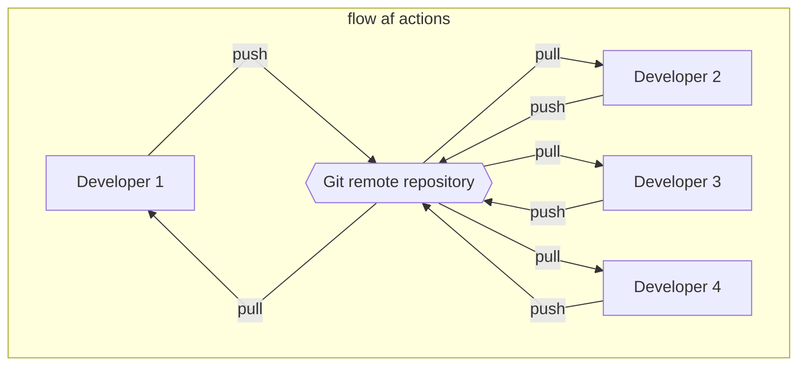
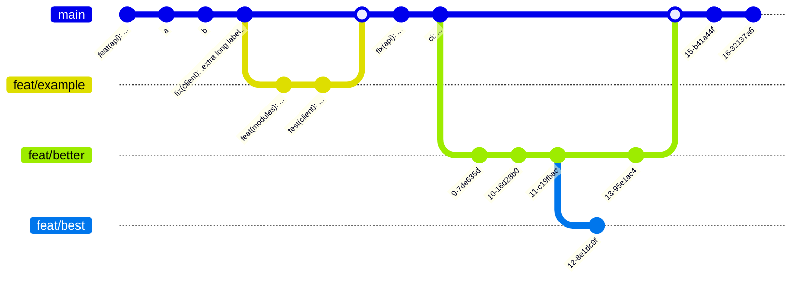

# A practical guide to Git
The ways programmers communicated 

<!--
The last comment block of each slide will be treated as slide notes. It will be visible and editable in Presenter Mode along with the slide. [Read more in the docs](https://sli.dev/guide/syntax.html#notes)
-->

---
transition: fade-out
class: text-center
title: What is Git?
---
# What is Git?

Git is a version control system that tracks changes in files for better coordination of your work and with your team members. 

---
transition: fade-out
---

# Actions that you do
-  ``git commit -m 'type your message here....'``
  - A package with changes that have been made to a repository 
- ``git push``
  - Sending one or multiple commits to a remote repository 
- ``git pull``
  - Getting all the changes from a remote repository

---
---

# Terms that you will need
- Branch
  - Separated version of a repository  
- Merge
  - An action that merges one branch into another branch
- Merge request
  - A merge request is requesting to code owners to merge branches

---
transition: fade-out
layout: two-cols
---

<template v-slot:default>

</template>
<template v-slot:right>

# Repository here repository there
Why do we need this?

1. Working in teams
2. Have your code always accessible form evey machine. 

</template>

---
transition: fade-out
---

# Branching
Building a beautiful tree. Each feature needs to have their own branch. 
**Its very important that you only change code corresponding with that feature, bug or any other issue.**

---
transition: fade-out
---

# Merge request / Pull requests

**A merge request is request to merge.**
 Pull requests have additional features that some git providers have. But at the end they execute a merge request
  Advantages of merge requests. 

1. It lists possible merge conflicts
2. Its communicates that your changes are ready to be deployed.